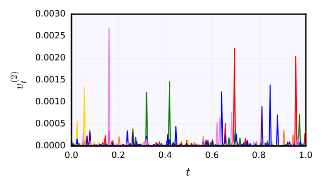
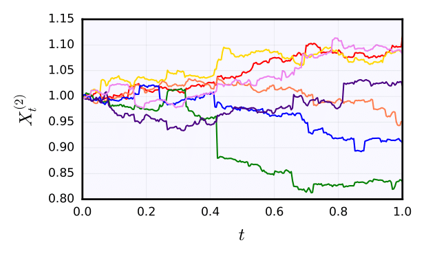
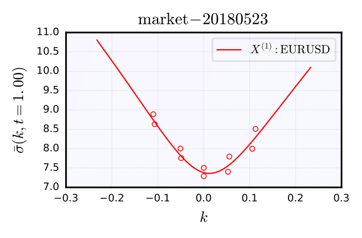
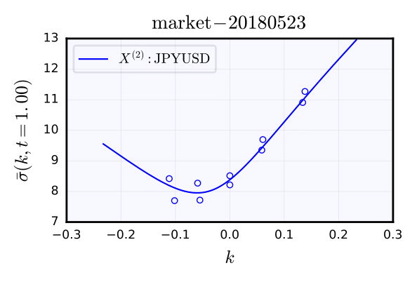
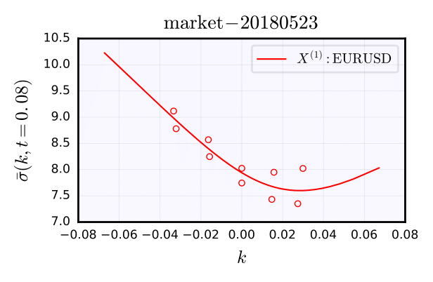
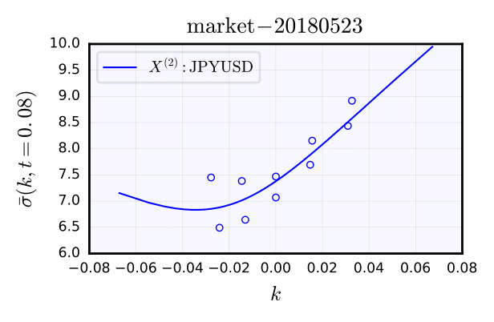
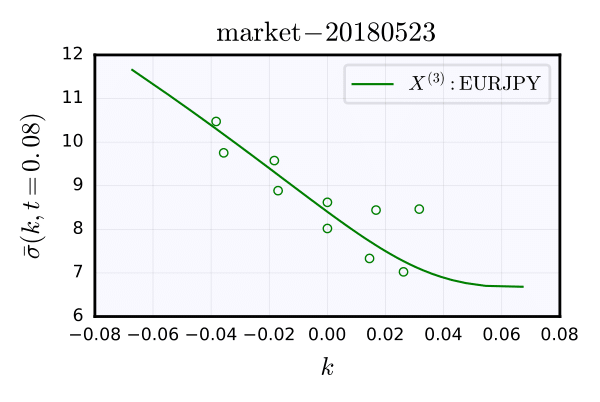

# Fast-reversion Heston FX

This repo contains code for the fast-reversion Heston (FRH) model of [Mechkov, 2015](https://papers.ssrn.com/sol3/papers.cfm?abstract_id=2418631), which is a reparameterisation of the normal-inverse Gaussian (NIG) process, studied greatly by Barndorff-Nielsen, among others. In particular, one can produce implied volatility surfaces analytically (fourier transform), and verify them by simulation.

The key contribution here is an implementation of a simple dependence structure between multiple FRH models, as well as the measure change analytics required to consistently evaluate inverse and cross process. We provide a very simple simulation procedure, amenable to quasi-random sampling, and expose some very interesting volatility surface symmetries exhibited by this model.

Cross symmetry:

 

Sample paths:

 

Delta symmetry:

 

Market comparison:

  
  

Example jupyter notebooks are included which demonstrate usage. Tested with Python 3.5.2 and macOS Sierra 10.12.5.
