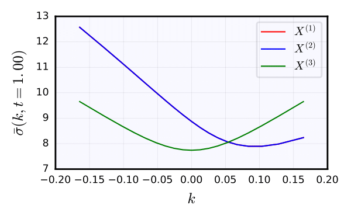
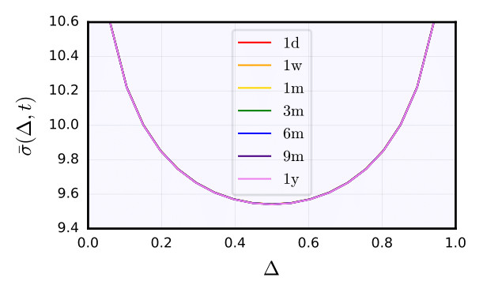
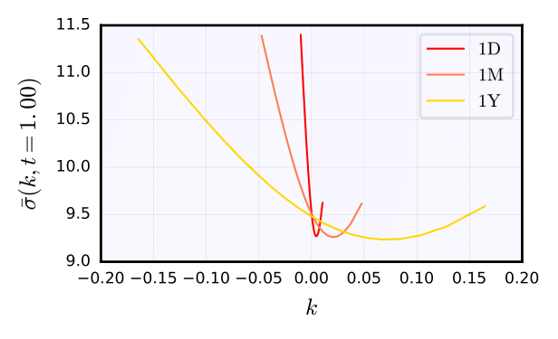
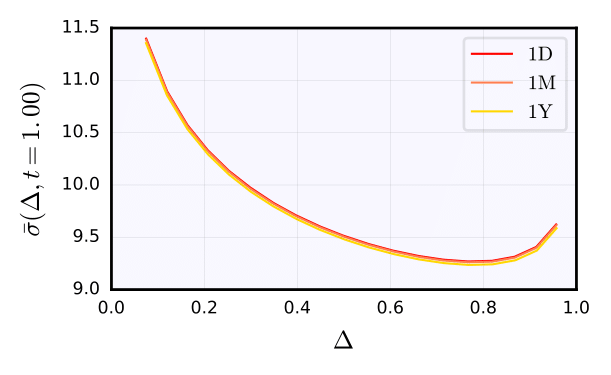

# Fast-reversion Heston FX
==========================

This repo contains code for the fast-reversion Heston (FRH) model of [Mechkov, 2015](https://papers.ssrn.com/sol3/papers.cfm?abstract_id=2418631), which is a reparameterisation of the normal-inverse Gaussian (NIG) process, studied greatly by Barndorff-Nielsen, among others. In particular, one can produce implied volatility surfaces analytically (fourier transform), and verify them by simulation.

The key contribution here is an implementation of a dependence structure between multiple FRH models, as well as the measure change required to compute cross process analytics. This is required for consistent modeling (triangulation) of FX rates, for example. We further expose some very interesting volatility surface symmetries exhibited by this model.

An example jupyter notebook is included which demonstrate usage. Tested with Python 3.5.2 and macOS Sierra 10.12.5.

 
 
